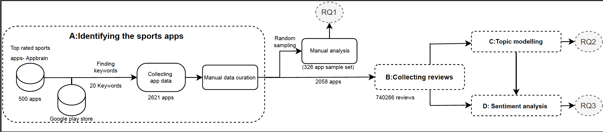

# SportsApp-Analysis
A large scale android sports app analysis
This repository contains the replication package for the paper "A Large-Scale Empirical Study of Android Sports Apps in the Google Play Store".

## Abstract
Prior studies on mobile app analysis often analyze apps across different categories or focus on a small set of apps within a category. These studies either provide general insights for an entire app store which consists of millions of apps or provide specific insights for a small set of apps.
However, a single app category can often contain tens of thousands to hundreds of thousands of apps. For example, according to AppBrain, there are 46,625 apps in the ``Sports'' category of Google Play apps.
Analyzing such a targeted category of apps can provide more specific insights than analyzing apps cross categories, while still benefit a very large number of app developers interested in the category.
In this work, we perform an empirical study on over two thousand sports apps in the Google Play Store. We analyze the characteristics of these apps (e.g., their main functionalities), the user reviews, as well as the aspects that contribute to the negative opinions of users.
Our work provides three folds of contributions: 1) we identified insights that are specifics for tens of thousands of sports apps; 2) we provide empirical evidence on the benefits of analyzing apps in a specific category; and 3) provide lessons learned from sports apps development that can benefit general app development.

## Introduction 

The replication package has been organised as follows, 
1. Data Collection: This directory contain all the code snippet used for data collection and preprocessing in this paper
2. Topic Modelling: Applying Mallet LDA and analysing code base on the reviews extracted
3. Analysis: Once topics are finalise we tried to analyse the data using sentiment to understand the factors the users are complaining about

### Data Collection

This part contains code and materials for preprocessing the dataset. All code could be found under the `Data Collection` folder.

   a. keyword_extraction.py: Generating sports related keywords from known information about sports apps for iterative search in google playstore to extract more sports related applications.
      Note:-In this section the final keywords are curated by manual analysis ( read more about the process in our paper(link) )
   
   b. app_details_extraction.py: Collecting metadata from google playstore for populating dataset for every keyword generated.
   
   Note:- As our study focuses only on sports related application except games, we did a manual analysis on the applications to make sure that the data did not contain any games/fantasy applications
   
   c. reviews_extraction.py: For all extracted sports apps collect the users reviews assoicated with them along with the meta data such as user review score.

You can use the given code to generate your own dataset or you can find the extracted reviews of all apps that we collected here.

### Topic Modelling

The given colab [Notebook](https://colab.research.google.com/drive/108V8KMsTeUH4knPBoCZ1dlWeLRUNSr16?usp=sharing) explains all the steps that we used for topic modelling on the reviews of the sports apps that we extracted and analysis that we did on the extracted topics and results.

 - > The given colab contains a section `Selecting best topic number based on coherence score of models` use the similar hyper parameters that we mentioned in our paper to obtain similar results also explore yourself for better hyper parameters according to your data.
 - > `sent_topics_sorteddf_mallet` includes all the reviews and the corresponding topics, we used the metric `Topic_Perc_Contrib` to remove the false positives, you can use the threshold mentioned in the paper or analyse the distribution of your data that you have and define a custom threshold too.
 
 The folder `Topic Modelling` contains the jupyterNotebook and the model generated, the corpus of the reviews and the word vocabulary generated in our analysis

### Analysis

In this section we are adding some exporatory data analysis and the visuralisation for the dataset that we used/created in this study.

1. [Top rated US apps](https://datastudio.google.com/reporting/89dd54e3-f18d-438f-be62-651c7a572b6a): It compare and plots data from Appbrain and help us to conclude some hypothesis. Due to the copy right issues we cannot share the AppBrain data. However you can find the latest top sports apps from the link [here](https://www.appbrain.com/apps/popular/sports/#) and recreate the results.
2. [Generic EDA on labelled Data](https://datastudio.google.com/reporting/d40a3824-b681-4560-915f-c52d79676b52): It evaluates the sample set generated  based on the sample set distribution mentioned in the paper and exclution of sports games apps followed by  manually labelled regarding the sports type, functionality analysed the distribution of the metadata associated with them.
3. [Sentiment Analysis](https://colab.research.google.com/drive/1xKugiEADKr_3CbbPbQKmxLdK_oaZDzLU?usp=sharing): Understanding the emotions associated with each reviews are one of the important motivations of our study. The libraries to extract the sentiment of user reviews and their comparison and Text Rating consistency analysis are given in the colab attached.

### Replicating Results

In this section we will conclude which script and data will help you to replicate all the RQs we have addressed in the given study 

Our code is based on the following packages and versions: 

- Python: 3.8.3
- NLTK: 3.7
- Spacy: 3.4.1
- TextBlob: 0.15.3
- Numpy: 1.21.6
- Pandas: 1.3.5
- Sklearn: 0.0
- Matplotlib: 2019.0
- gensim: 3.6.0
- pyLDAvis: 3.3.1

For the libraries that are not listed here you can use the latest version.

**1.   RQ1: What are the characteristics of sports apps?**
To understand the categories of sports apps and classify them, we are manually analysing the sample set of data. Followed by creating a sample set of the data set and we categorize them based on three features, i.e., (1) Type of sports, (2) Main functionality, (3) Analytical/statistical algorithm used.

-> Data collection and extraction methods are given in the section `Data Collection` above, the final results considered for our studies are given [here]() in the the folder `All_apps_ids_reviws_metadata.zip`. The dataset are protected by password, and the password are mentioned in our published [paper](). 
Moreover, the sampled data and the mmanual analysis can be found in the folder `Sample_data_with_manual_labelling.zip`
